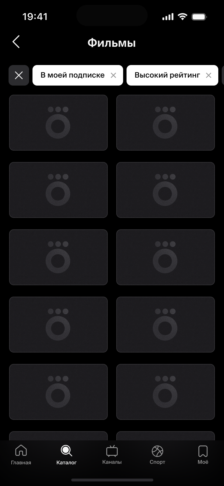
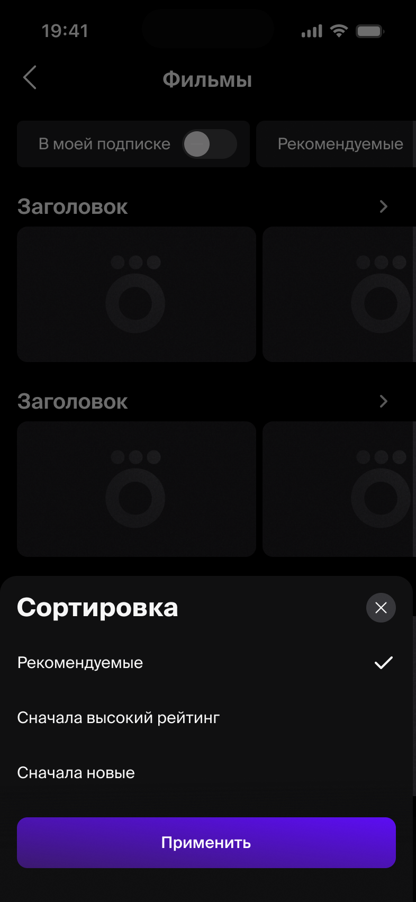
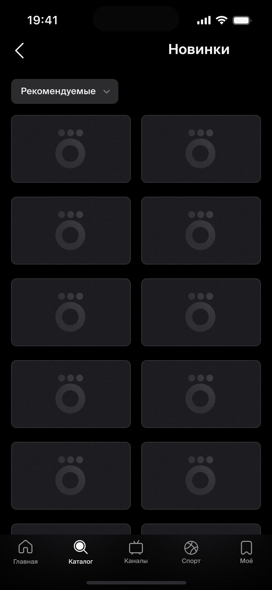

# Группа компонентов: Filters (Фильтрация)

> Зонтичный гайд по группе фильтрации. Связывает три компонента:
> - [`Chips`](chips.md) — компактный выбор, когда варианты помещаются на экран
> - [`Select`](select.md) — компактный фильтр-дропдаун со счётчиком, раскрывает список в шторке
> - [`BottomSheetFilters`](sheet-template-filters.md) — шаблон шторки выбора (в Figma: `Шаблоны шторки / Фильтры`), вызывается из `Select`
>
> Продуктовый кейс-источник: файл **«Афиша в рамках Okko 3.0 — iOS»**, секция `Фильтрация ✅` — node `8563:230330` (fileKey `xFhW4a26fD7hE0zK88ClF2`). Платформы: iPhone + iPad (есть адаптивы под iPad 10 / iPad Pro 13, портрет и ландшафт).

Документ описывает **продуктовое поведение** группы — флоу, типы фильтров, правила поиска, состояния и corner-cases. Базовая анатомия/свойства каждого компонента — в их карточках.

---

## 1. Флоу выбора

### Множественный выбор (мульти)

- Работает **по принципу «ИЛИ»** (выбранные значения объединяются по OR). Так же реализованы **жанры**.
- **Первое посещение** — список в обычном порядке, ничего не выбрано.
- **Повторное посещение** — все ранее выбранные пункты показываются **наверху** списка.
- **Снятие выбора при повторном посещении** — снятые айтемы **остаются на своих местах** (не уезжают вниз); остальное (не выбранное ранее) идёт в привычном порядке.

### Единичный выбор (сингл)

- При изменении выбора **предыдущее значение сбрасывается** (всегда выбран ровно один пункт).
- **Выбор города** — тоже единичный выбор, но **без нижних кнопок** (Применить/Сбросить отсутствуют, см. ниже).

### Перемещение выбранного в начало

- При выборе элемента он **переходит в начало** списка/строки фильтров.
- Анимация перемещения — **300 ms** после нажатия.
- Подгрузка пунктов при этом происходит **скелетонами** (skeleton loading).

### Много активных фильтров

- Если выбрано **более 3 категорий** фильтрации — выводим **кнопку сброса всех фильтров одновременно** (закрыть все).

---

## 2. Типы фильтров (домен «Афиша»)

| Фильтр | Тип / правило |
|---|---|
| **Театр / кинотеатр / площадка** | обычно стоит первым в подразделах; как правило >20 вариантов → с поиском, если <20 → без поиска |
| **Жанр** | множественный, по принципу «ИЛИ» |
| **Возраст** | без поиска |
| **Тип события** | присутствует только при переходе с главной через календарь в грид |
| **Пушкинская карта** | без поиска |
| **Детские** | без поиска |
| **Скидки** | отбирает события со скидками |
| **Премьеры** | может быть «премьеры недели» |
| **Высокий рейтинг** | события с рейтингом выше 7 |
| **Кешбэк и оплата бонусами** | без поиска |
| **Выбор редакции** | «Выбор Афиши», замаскированный под «выбор редакции» — **про Афишу не упоминаем** |

---

## 3. Поиск внутри шторки

Показ поля поиска зависит от **числа вариантов** в списке:

| Кол-во вариантов | Поиск |
|---|---|
| **> 20** | поиск **показываем** |
| **< 20** («мало вариантов») | поиск **не показываем** |
| **очень мало** (помещается на один экран) | поиск не нужен |

---

## 4. Кнопки шторки (Применить / Сбросить)

(Полные правила — в [BottomSheetFilters](sheet-template-filters.md#варианты-фильтра-и-поведение-кнопок).)

- Выбор применяется **только по «Применить»**; закрытие шторки без неё (×, свайп, тап по затемнению) — выбор **не применяется**.
- **«Сбросить»**: неактивна, пока выбор не менялся относительно изначального; активируется после изменения.
- **Выбор города** — единственный кейс **без нижних кнопок**: город обязателен и применяется иначе (значение всегда есть, сбросить «в пусто» нельзя).

---

## 5. Отображение в Chips / Select после применения

- **Выбран один пункт** — чип/селект показывает **имя выбранного значения**.
- **Выбрано 2 и более пунктов** — показывается **counter** (число выбранных).
- После применения выбранный чипс/селект **перемещается в начало** строки фильтров (анимация 300 ms).

---

## 6. Состояния (стейты)

- **Загрузка результатов** — после применения фильтра результаты подгружаются **скелетонами** (есть адаптивы скелетонов под разные экраны).
- **«Ничего не нашлось»** — пустое состояние, когда под фильтр/поиск нет результатов.
- **Дизейбл пунктов** — отдельные пункты списка могут быть недоступны (disabled).
- **Появление кнопок** — кнопки футера шторки появляются с анимацией.

---

## 7. Платформы

- iPhone — компактная шторка снизу.
- iPad — есть отдельные адаптивы фильтрации (iPad 10 / iPad Pro 13, портрет и ландшафт), в т.ч. вариант «мало вариантов».

---

## 8. Применение в продуктовом кейсе (Афиша)

Как группа работает на реальных экранах раздела «Афиша».

### Строка фильтров в гриде/каталоге

Сверху грида — горизонтальная строка фильтров, в ней одновременно соседствуют:

- **Chips** для бинарных/быстрых фильтров без списка — `В моей подписке`, `Высокий рейтинг`, `Новое`.
- **Select** (дропдаун) для фильтров со списком — `Сортировка`, `Жанр`, `Годы`, `Страна`, `Театр/площадка`.

Активный (выбранный) элемент **уезжает в начало** строки (анимация 300 ms).

### Сценарий A — мультивыбор «Жанр» (множественный, ИЛИ)

1. Тап по `Жанр` → открывается **BottomSheetFilters** «Жанры».
2. Список пуст (мульти всегда стартует пустым), `Сбросить` неактивна. Поиск показывается, если жанров >20.
3. Отмечаем `Ужасы`, `Приключения`, `Комедии` → `Сбросить` активна.
4. `Применить` → шторка закрывается, селект показывает **counter** `Жанры · 3` и уезжает в начало.
5. Повторное открытие — выбранные жанры показаны **наверху** списка.
6. `×` на селекте — очистка до пуста.

### Сценарий B — сортировка (единичный, с дефолтом)

1. Тап по `Сортировка` → шторка с выбранным по умолчанию `Рекомендуемые ✓`; `Сбросить` неактивна.
2. Выбираем `А-Я` → предыдущее значение сбрасывается (всегда один пункт), `Сбросить` активна.
3. `Применить` → чип показывает имя `А-Я`.
4. `×` на чипе — возврат **к дефолту** (`Рекомендуемые`), не к пустому.

### Сценарий C — выбор города (уникальный единичный)

1. Чип города в шапке главного экрана Афиши (напр. `Москва`) → полноэкранная шторка «Город».
2. Есть **поиск** («Найти город»); выбранный город закреплён вверху, остальные — по алфавиту.
3. **Нижних кнопок нет** (город обязателен): выбор применяется сразу/по `Применить` на всю ширину, сброса нет.

### Сценарий D — фильтры из календаря

При переходе с главной **через календарь в грид** дополнительно появляется фильтр **`Тип события`** (которого нет в обычном гриде).

### Сценарий E — много активных фильтров

Когда выбрано **более 3 категорий**, в строке появляется кнопка **сброса всех фильтров сразу**.

### Состояния в кейсе

- После применения — результаты грузятся **скелетонами**.
- Если под фильтр нет результатов — экран **«Ничего не нашлось»**.

---

## 9. Применение: каталог-категория и коллекции

Второй продуктовый кейс — страница **категории каталога** и **коллекции** фильмов/сериалов (раздел «Category + collection»). Покрывает iPhone 15 / 17 Pro Max и iPad 10 / Mini 6 / Pro 13 (портрет + ландшафт).

### Строка фильтров на странице категории

- Фильтры идут строкой над гридом: статичные **Chips** (`В моей подписке`, `Высокий рейтинг`, `Новое`, `Новое в подписке`) и **Select** (`Рекомендуемые`/сортировка, `Жанр`, `Годы`, `Страна`).
- Когда есть применённые фильтры, **в начале строки появляется круглая кнопка × — сброс всех фильтров сразу**.
- Активные чипы показывают **индивидуальный ×** для снятия по одному.
- При скролле строка фильтров **залипает (sticky)** над контентом.

### Сортировка (шторка)

- Опции: `Рекомендуемые ✓` (дефолт), `Сначала высокий рейтинг`, `Сначала новые`.
- Единичный выбор с дефолтом; в этом кейсе шторка с **одной кнопкой «Применить» на всю ширину** (без «Сбросить» внутри шторки — сброс вынесен на уровень страницы).

### Страница коллекции

- Коллекция (напр. «Новинки») переиспользует ту же группу, но в минимальном виде — обычно один **Select-сортировка** (`Рекомендуемые ▾`) над гридом.

### Нулевое состояние (ничего не найдено)

- Иллюстрация + заголовок **«Увы, нам ничего не удалось найти»** + подпись **«Попробуйте изменить фильтры или сбросьте их»**.
- Действие — primary-кнопка **«Сбросить фильтры»** (в части экранов также **«Вернуться назад»**).
- Строка фильтров с активными значениями и кнопкой сброса всех остаётся сверху.

### Недоступные теги

- Отдельные пункты/теги фильтра могут быть **недоступны (disabled)** — когда под них нет результатов в текущей выборке.

### Сброс всех фильтров

- Помимо круглой × в строке, на странице/в нулевом состоянии есть явная кнопка **«Сбросить фильтры»** — снимает все применённые фильтры разом.

---

## Источник

- Продуктовый кейс 1 (Афиша): Figma `xFhW4a26fD7hE0zK88ClF2` node `8563:230330` (секция `Фильтрация ✅`, файл «Афиша в рамках Okko 3.0 — iOS»).
- Продуктовый кейс 2 (Каталог-категория + коллекции): Figma `Z4cJG20xxYb6oEECodt5WD` node `2441:143240` (секция `Category + collection`, файл «ios-коллекции»). Скрины — `assets/filters-collection-*.png`.
- Компоненты группы: [chips.md](chips.md), [select.md](select.md), [sheet-template-filters.md](sheet-template-filters.md).
